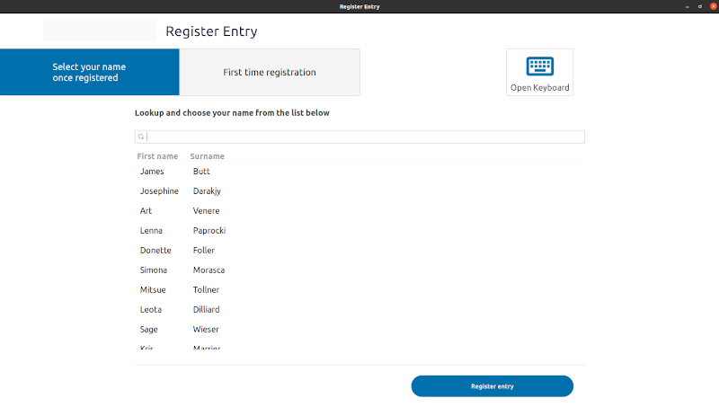

# Register Entry

Register entry is a Python GTK3 program to register entry into buildings (due to COVID)

## Installation

Obtain a clone of this repository
Use the package manager [pip](https://pip.pypa.io/en/stable/) to install [pipenv](https://pipenv.pypa.io/en/latest/). Use pipenv to install the application dependencies.

```bash
pip install pipenv

pipenv sync
```
## Usage

The script's intended usage is on a simple Windows or Linux device, ideally with a touch screen. The user can call up the on-screen keyboard by pressing the button marked with the keyboard sign (⌨).



The script reads a list of names from the file *"employees.xlsx"* to show them in the list-box for easy selection. Manual entry is also supported. Both selected as well as manually entered names will be written to the file *"entries.xlsx"* with the date/time of entry. In case of manual entry, if the user selects the check-box "employee", then their data will be written to the file *"employees.xlsx"* and shown in the list-box. This will allow them to select their name from the list the next time they enter. Both Excel files need be stored together in the same directory, the *data directory*. By default, the script will treat the current working directory (the "active" directory from which the command to execute the script was launched) as the *data directory*. Alternatively, the script can take one parameter consisting of the path to the *data directory*.

for example:

```bash
python register_entry.py /home/user/register-data
```

Additional input parameters (in the script is is the number of masks taken) can be easily customized in the custom dialog *ExtraDataDialog*, called from *run_extra_data_dialog*. 

## Contributing
Pull requests are welcome. For major changes, please open an issue first to discuss what you would like to change.

Please make sure to update tests as appropriate.

## License
[BSD-3-Clause](https://choosealicense.com/licenses/bsd-3-clause-clear/)
